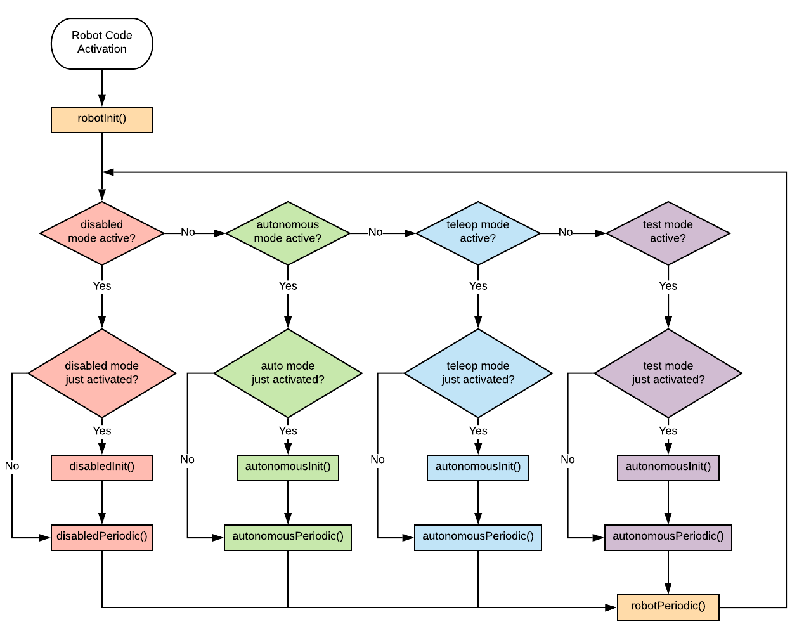

# Running the Robot Code

The Robot Code is ran automatically, however it is unclear whether it starts when the Driver Station
(or similar) establishes a connection to the Robot or before. The behavior once the Robot Code has
started is influenced by the current Robot Mode.

## Robot Modes

While the Robot Code is running, the Robot is always in one of 4 modes: `Disabled`, `Autonomous`, 
`Teleop`,and `Test`. During a match, the Field Management System (FMS) controls the Robot's mode. 
When not on the field (pit, practice, demo, etc) the operator can set the mode using the 
Driver Station.

## Robot Execution

The Robot execution uses a combination of "initialization" and "periodic" methods. The 
"initialization" methods are called once at the start of an activation and the "periodic"
methods are called once every robot tick for as long the activation exists. This is 
illustrated in the following flow diagram.



### Robot Init and Periodic

You'll notice that `robotInit()` is only called when the Robot Code is activated. It will
never be called again unless the Robot Code is restarted.

On the other hand, `robotPeriodic()` is called on every iteration, regardless of what Robot Mode 
is active; **this means `robotPeriodic()` is called even when the Robot is _Disabled_!**

>Pro-tip: `TigerTimedRobot` expands `robotInit()` into several smaller, more focused methods. You
can learn more about it in `/docs/TIGER_TIMED_ROBOT.md`.

### Mode Init and Periodic

Each game mode has its own `*init()` method that is called **every time** the mode is activated.
During a match, the activation sequence is always the same so the behavior of sequence of the 
`*init()` methods is predictable.
```
Disabled -> Autonomous -> Teleop -> Disabled
```

However, during a practice or pit session the sequence can be unpredictable. For example, consider
a Telop practice session where the robot is enabled, driven, then disabled 3 times without restarting
the Robot. The activation sequence would look like this:
```
Disabled -> Teleop -> Disabled -> Teleop -> Disabled -> Teleop -> Disabled
```

In _this_ practice session, `telopInit()` is ran **3 times** and `disabledInit()` is ran 
**5 times** and the next practice session could be completely different. This is why it is **very**
important to make sure the `*Init()` method for each mode can safely run more than once without
side-effects.

>Pro-tip: `TigerTimedRobot` makes some enhancements to help avoid duplicate initializations and
to make the activation sequence of modes more predictable. Learn more by reading 
`/docs/TIGER_TIMED_ROBOT.md`.