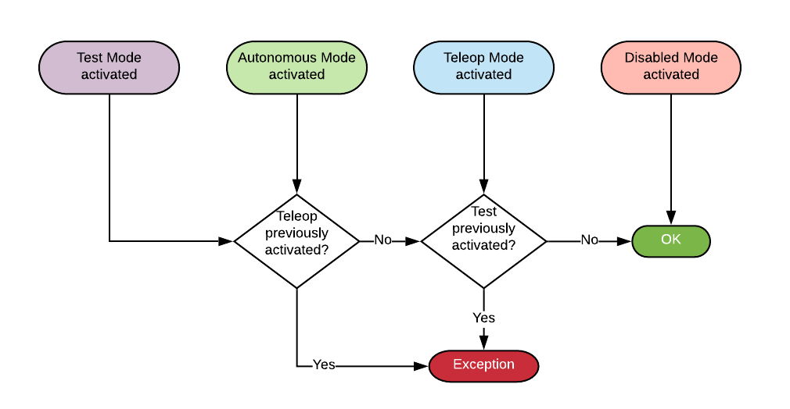
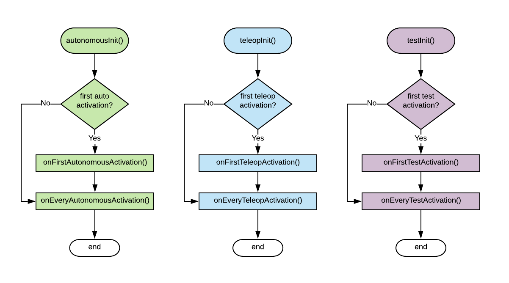
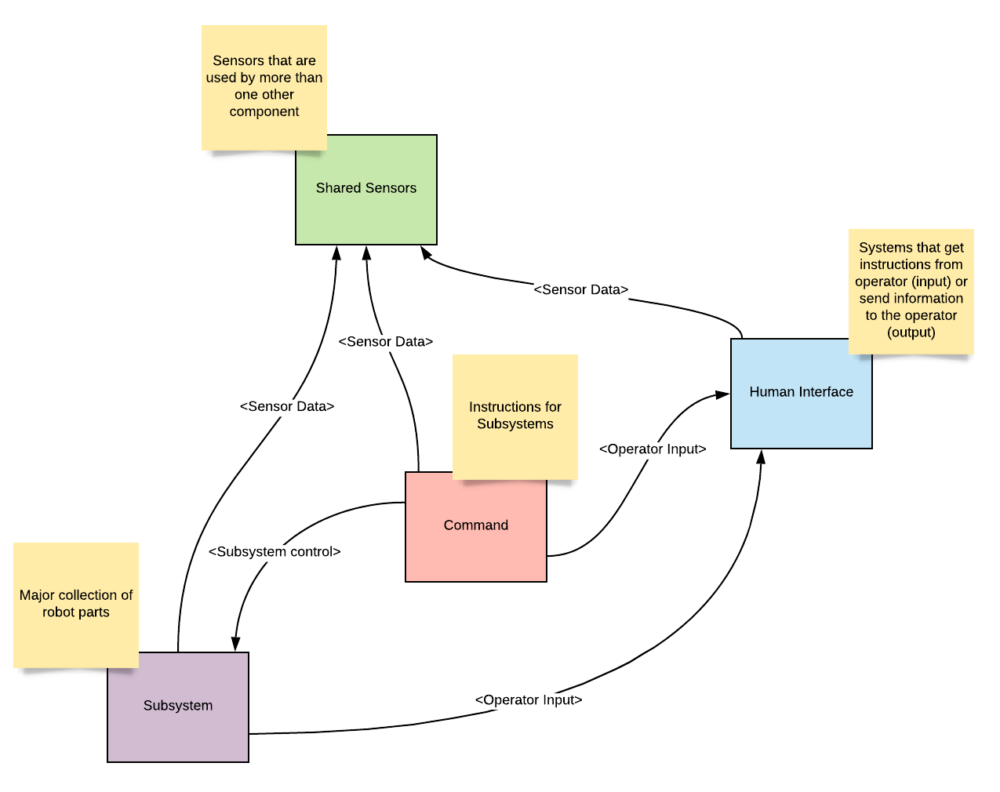
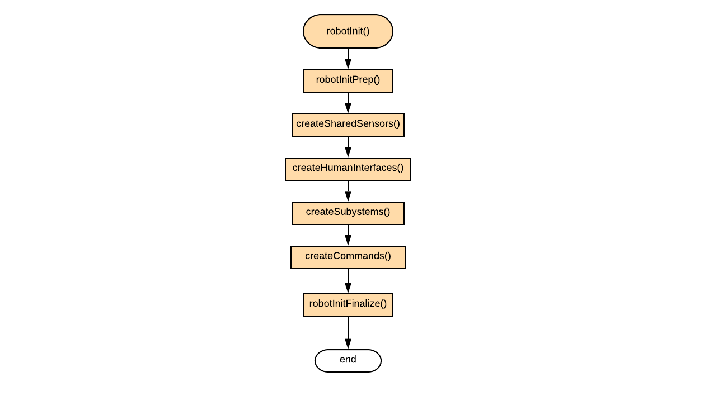

# `TigerTimedRobot`

If you have not read the `Robot Execution` article, read `/docs/ROBOT_EXECUTION.md` before continuing.

The `TigerTimedRobot` class is an extension to the WPI lib `TimedRobot`. This is the base class we
use for our `Robot` class. 

## The "Tick" Period

`TigerTimedRobot` is based on WPI's `TimedRobot` -- this means its iterations are set to occur on
on interval. The time between ticks is known as the "period". If a Robot has its period set to 
`.02` seconds, then it will "tick" up to 50 times per second. The time-based is preferred over other
techniques because it produces more repeatable results.

If the Robot's periodic work (the work it needs to do on each iteration) takes longer than the set
period, the next iteration will be delayed. This could have negative effects on logic that expects
the ticks to come at set intervals. For example, closed feedback loops (e.g. PIDs) may not work
as well. It is important to minimize delayed iterations.

The tick period is set during the constructor of the `Robot` class.
```java
package org.team1251.frc.robot;

import org.team1251.frc.robotCore.TigerTimedRobot;

class Robot extends TigerTimedRobot {
    // Constructor
    public Robot() {
        // Set a tick interval of 2-hundredths of a second
        // This will give us 50 ticks per second
        super(.02);
    }
}
```

## Robot Mode Sequence Limits

The `Robot Execution` article mentions that the sequence of Robot Modes during practice and pit
sessions can be unpredictable. For example, Teleop mode always follows Autonomous mode during a
match but the order may be reversed during practice sessions. This can cause the Robot to behave 
in unexpected ways. Test mode can be especially problematic because it _never_ runs during a match 
and may attach gamepad buttons to commands that conflict with Teleop behavior.

To make this less of a problem, `TigerTimedRobot` limits the sequence of Robot Modes. These limits
are shown in the following flow chart.

The sequence limits are as follows:

 - Disabled mode may always be ran
 - Test mode may not be ran if Teleop mode Autonomous mode was previously activated. 
 - Autonomous mode may not be ran after Teleop or Test mode has been activated.
 - Teleop mode may not be ran after Test mode has been activated.
 
The limits are also illustrated in the following flow chart.


>Pro-tip: The sequence limits do not solve the challenge with the same `*init()` method running 
more than once. `TigerTimedRobot` solves this in a different way -- see the 
[Enhanced Robot Mode Initialization](#enhanced-robot-initialization) section for more info.

### Violating Sequence Limits

If sequence limits are violated, then the new mode will fail to activate an a `RuntimeException` 
will be thrown causing the Robot Code to exit with an error and restart. An error will also be
written to the Driver Station console so that the operator understands why the Robot crashed 
when it was enabled.

## Enhanced Robot Mode Initialization

`TigerTimedRobot` makes it easier to make sure that certain initialization tasks only happen the
_first_ time a Robot Mode activates. This helps solve most of the challenges around `*init()`
methods running more than once. 

The following flow chart illustrates the enhancement.


Simply put, `onFirst*Activation()` is called the first time a mode is activated and `onEvery*Activation` 
is called every time the mode is activated, _including the first time_.

**Note that the `Disabled` mode is not enhanced. Continue to use the `disabledInit()` method, as you normally
would.**

When creating a `Robot` class based on `TigerTimedRobot`, you SHOULD NOT define the default `*Init()` methods
for the enhanced modes (`Telop`, `Auto`, and `Test`). These new methods are _abstract_, so you MUST implement
all of them, but may MAY leave them empty. 

## Enhanced Robot Initialization

The bulk of the initialization tasks that need to be done will occur during robot initialization. This is where you
will create most of your subsystems, commands, etc. 

`TigerTimedRobot` breaks `robotInit()` down into more specific methods to make it easier to keep everything organized.

The most significant thing that happens during Robot Initialization is creation of robot components. If we generalize
these into 4 categories, we can decide what order they should be created in by examining how they rely on one another.
The categories are, `Subsystems`, `Shared Sensors` (sensors used by more than one component), `Commands`, and `Human
Interfaces` (operator input/output).  

The way these rely on one another is shown in this diagram.



We can see that `Commands` rely on all other types of components, so they have to be created after everything else.
  - Commands must have control over Subsystems
  - Commands may rely on sensor data from a shared sensor
  - Commands may rely on operator input from a human interface
  
We can see that `Subsystems` rely on `Shared Sensors` and `Human Interfaces`, so they must be created after those.
  - Subsystems may rely on sensor data from a shared sensor
  - Subsystems may rely on operator input from a human interface

We can see that `Human Interfaces` only relies on `Shared Sensors`, so they have to be created after them. 
  - Human Interface may rely on sensor data from a shared sensor (to provide feedback to operator)
  
Finally, we can see that `Shared Sensors` do not rely on other components, so they can be created first.

If we put those in order we end up with:
  1. Shared Sensors
  2. Human Interfaces
  3. Subsystems
  4. Commands
  
Now, if we look at the flow of the Enhanced Robot Initialization, we can see that each of these have their own focused
method that are ran in that order.



Notice that there is two extra methods -- one at the beginning (`robotInitPrep()`) and one at the end 
(`robotInitFinalize()`). These accommodate for initialization tasks that don't fit into any of the other methods. 
Tasks that do not rely on the components should be done in `robotInitPrep()` and those that do rely on components 
should be done in `robotInitFinalize()`.

## Default `robotPeriodic()`

`TigerTimedRobot` also provides a default implementation for `robotPeriodic()` that sends 
[Telemetry Data](TELEMETRY.md) and runs the Command scheduler.

## StubRobot

The `org.1251.frc.robotCore.StubRobot` can be used as a template for the `Robot` class. It has placeholders for all
of the methods discussed here